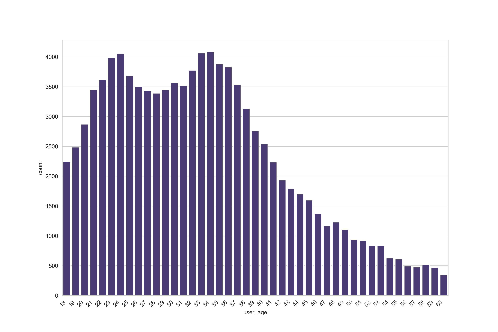
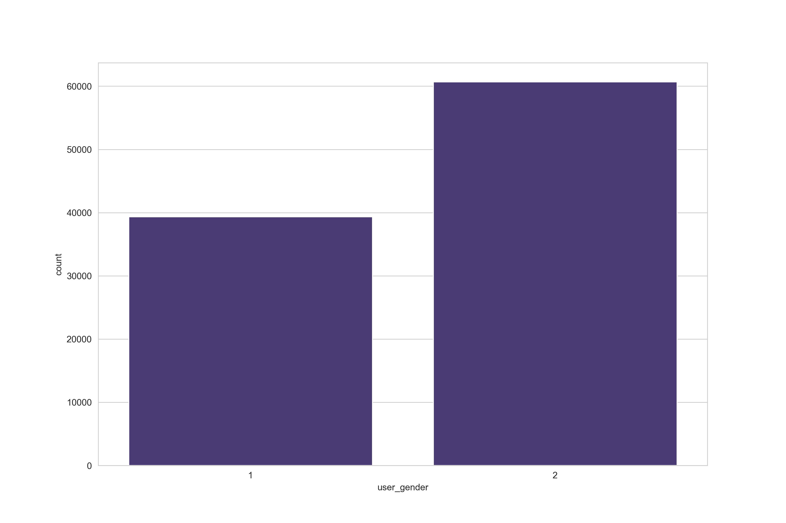
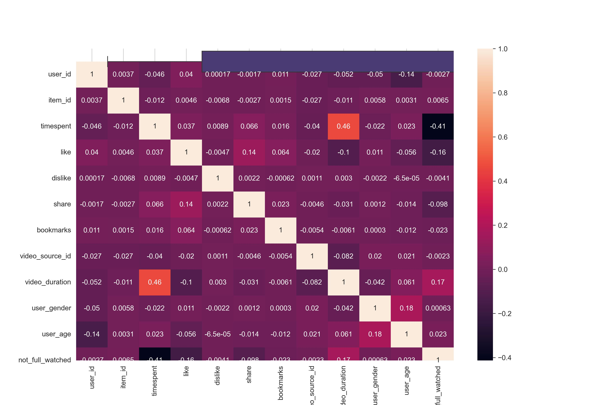
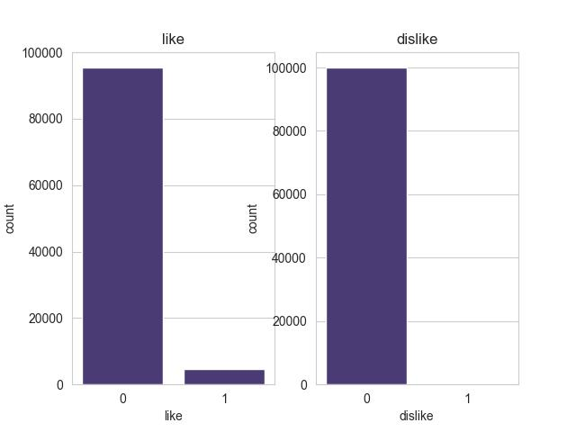

<!-- Место для картинки -->
<p align="center">
  
</p>

<!-- Название проекта -->
<h1 align="center">Machine learning model creation project for VK RecSys Challenge</h1>

<!-- Описание проекта -->
<p align="center"><i>As part of this project, I carried out a full cycle of work with data: from their analysis and preprocessing to the construction and study of machine learning models. The goal of the project was to determine the most suitable model that could recommend videos to other users. </i></p>

---

## Chapter 1. Introduction
Goal: build a model that will predict user likes/dislikes in the future.

Data: the main data is a sparse matrix of interactions between a set of users U and a set of objects I. There is also additional data on users (gender, age), objects (e-mails, video authors)
Metric: ROC AUC on 3 labels (like = 1, dislike = -1, ignore = 0)

---

## Chapter 2. Data Analysis and Visualization
In the first phase of the project, I conducted exploratory data analysis (EDA) to examine the structure and characteristics of the data. Key steps included:

Identifying patterns, gaps, and outliers in the data.
Visualizing the data using matplotlib and seaborn libraries to better understand the distributions and relationships between variables.

I ended up with these graphs:

<table>
  <tr>
    <td></td>
    <td></td>
  </tr>
  <tr>
    <td></td>
    <td></td>
  </tr>
</table>

---

## Chapter 3. Installation and Launch
Instructions for installation, cloning the repository, installing dependencies, and launching the project:

```bash
# Cloning the repository
git clone https://github.com/A-PseudoCode-A/Pet_project_VK_recsys.git

# Installing dependencies
pip install -r requirements.txt