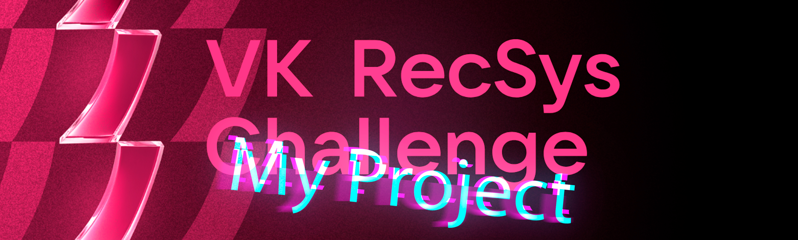

<!-- Место для картинки -->
<p align="center">
  
</p>

<!-- Название проекта -->
<h1 align="center">Machine learning model creation project for VK RecSys Challenge</h1>

<!-- Описание проекта -->
<p align="center"><i>В рамках данного проекта я провел полный цикл работы с данными: от их анализа и предобработки до построения и изучения моделей машинного обучения. Целью проекта было определить наиболее подходящую модель, которая бы смогла рекомендовать видео другим пользоватеям. </i></p>

---

## Глава 1. Введение
Цель: построить модель, которая будет предсказывать лайки/дизлайки пользователей в будущем. 
Данные: основные данные - это разряженная матрица взаимодествий множества пользователей U и множества объектов I. Также дополнительно есть данные о пользователях (пол, возраст), объектах (емюеддинги, авторы видео)
Метрика: ROC AUC на 3-х метках (like = 1, dislike = -1, ignore = 0)

---

## Глава 2. Анализ и визуализация данных
На первом этапе проекта я провел исследовательский анализ данных (EDA) для изучения структуры и характеристик данных. Ключевые шаги включали:

Выявление закономерностей, пропусков и выбросов в данных.
Визуализация данных с использованием библиотек matplotlib и seaborn для лучшего понимания распределений и взаимосвязей между переменными.

В итоге я пришел к таким графикам (ВСТАВИТЬ РИСУНКИ)

---

## Глава 3. Установка и запуск
bнструкции по установке, клонированию репозитория, установке зависимостей и запуску проекта:

```bash
# Клонирование репозитория
git clone https://github.com/A-PseudoCode-A/Pet_project_VK_recsys.git

# Переход в директорию проекта
cd ваш_проект

# Установка зависимостей
pip install -r requirements.txt